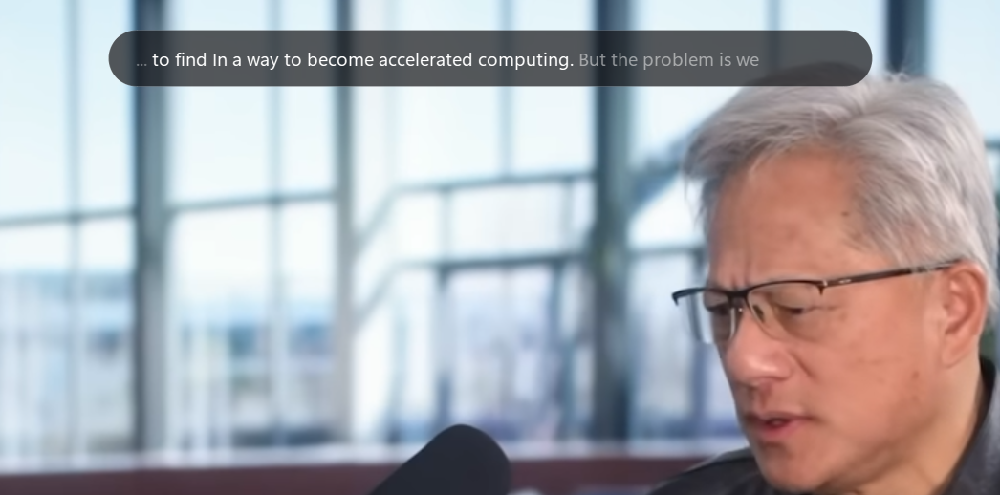

# Real-Time WASAPI Transcription HUD (v3.0)

Local, real-time meeting transcription with semantic search and AI summaries. GPU-accelerated, no cloud APIs required for the core pipeline.



## Features

- **System Audio Capture:** Captures loopback speaker audio directly via Windows WASAPI drivers (`PyAudioWPatch`).
- **Audio Preprocessing:** NumPy pipeline downmixes stereo to mono, resamples 48kHz to 16kHz, and normalizes 16-bit PCM to float32.
- **Dual-Layer Voice Activity Detection:** A custom RMS energy gate detects speech pauses (~370ms) to flush audio dynamically without slicing words in half, while `faster-whisper`'s built-in Silero filter strips residual noise before inference.
- **GPU-Accelerated Inference:** Runs `faster-whisper` (CTranslate2) locally on NVIDIA CUDA (`base.en`, int8).
- **Live Two-Tone Streaming:** Draft words stream to the overlay as you speak, locking in as solid white once a pause confirms the sentence is final.
- **Dual-Write Logging:** Finalized transcripts are stored in `transcripts.db` (SQLite) for chronological logs and embedded into `chroma_db` (ChromaDB) for semantic search.
- **Local Semantic Search & RAG:** Query past meetings offline via `sentence-transformers`, with an optional RAG mode to synthesize answers.
- **Automated Meeting Summaries (Optional):** On exit, compiles the session transcript and calls an LLM API (Groq) to generate an executive report in `summaries/`.
- **Transparent Click-Through UI:** A borderless, semi-transparent PyQt6 overlay using Win32 API flags so mouse clicks pass through to background apps, with a 5-second auto-clear on silence.

## System Architecture

```text
[Windows Speakers] ──> (WASAPI Loopback) ──> [Audio Queue]
                                                  │
[PyQt6 HUD Thread] <──   (Qt Signals)   <── [Audio Worker Thread]
  (Click-Through)                                 │
                                         (NumPy Downmix & Resample)
                                                  │
                                         [Dual-Layer VAD Check]
                                                  │
                                      [Faster-Whisper on CUDA]
                                                  │
                                          (Dual-Write DBs)
                                          ┌───────┴───────┐
                                      [SQLite]       [ChromaDB]
                                          │               │
                                  (On Exit/Ctrl+C)   (search.py)
                                          ▼               ▼
                                 [LLM Summarizer]  [Local RAG Engine]
                                          │
                              [summaries/summary.md]
```

For the full Technical Deep Dive and benchmark history see [documentation.md](documentation.md).

## Installation

1. Clone the repository:

```bash
git clone https://github.com/yassdev212/Realtime_audio_transcription.git
cd Realtime_audio_transcription
```

2. Create a virtual environment and install dependencies:

```bash
python -m venv .venv
.venv\Scripts\activate
pip install -r requirements.txt
```

3. Install NVIDIA CUDA runtime libraries (for GPU acceleration):

```bash
pip install nvidia-cublas-cu12 nvidia-cudnn-cu12
```

*(On Windows, the installed DLL directories may need to be added to your Python path or placed in the CTranslate2 directory — see `engine.py`.)*

4. Configure an API key (optional, for summaries and full RAG):

The core HUD, audio capture, local transcription, and semantic search are **100% offline and require no API key.**

To enable meeting summaries and RAG synthesis, create a `.env` file in the project root:

```env
GROQ_API_KEY=gsk_your_api_key_here
```

*(Without a key, the app still exports the full raw transcript on exit and runs plain semantic search — nothing breaks.)*

## Usage

### Running the live HUD
```bash
python main.py
```
Press `Ctrl+C` to exit. This shuts down cleanly, queries SQLite for the session, and saves an AI summary to `summaries/summary_<session_id>.md`.

### Standalone summarizer CLI
```bash
python summarizer.py --list                 # list all past sessions
python summarizer.py                        # summarize the most recent session
python summarizer.py Session_20260818_1430  # summarize a specific session
```

### Local semantic search CLI
```bash
python search.py "meeting verdict"          # pure local semantic search
python search.py --ask "What was decided?"  # full RAG: search + LLM synthesis
```

## Roadmap

- [x] **V1.0:** Core audio-to-text HUD pipeline
- [x] **V2.0:** SQLite persistent session logging and native exit exporter
- [x] **V2.5:** Dual-layer VAD (energy gate + neural Silero filter) — WER 26.83%, inference ~0.32s, perceived lag ~0.56s
- [x] **V2.7:** Automated meeting summaries via LLM API, standalone CLI, live two-tone interim streaming, 5s UI auto-clear
- [x] **V3.0:** Local semantic search (`search.py`) with `sentence-transformers` + `chromadb`, and optional RAG synthesis

## License

MIT License. Feel free to use, modify, and learn from this code!