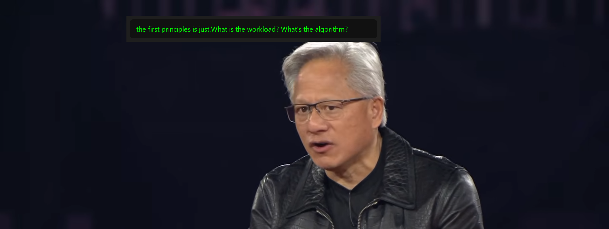

# 🎙️ Real-Time WASAPI Transcription HUD

A real-time, GPU-accelerated desktop overlay that transcribes system audio instantly. Built entirely in Python, this tool operates 100% locally for maximum privacy—no cloud APIs, no subscriptions, and no data leaving your machine.



## 🚀 Features
* **Real-Time System Audio Capture:** Bypasses standard microphone inputs by hooking directly into Windows WASAPI Loopback drivers (`PyAudioWPatch`).
* **Low-Latency DSP Pipeline:** Custom NumPy digital signal processing to downmix stereo channels and resample 48kHz audio to 16kHz float32 arrays on the fly.
* **GPU-Accelerated Inference:** Utilizes `faster-whisper` (CTranslate2) on NVIDIA CUDA for highly accurate, sub-300ms speech-to-text processing.
* **Thread-Safe Architecture:** Implements a producer-consumer queue design with PyQt6 Signals to prevent UI-blocking during heavy AI inference.
* **Click-Through UI:** A transparent, always-on-top PyQt6 desktop overlay utilizing Win32 API flags for a seamless, non-intrusive user experience.

## 🧠 System Architecture

```text
[Windows Speakers] -> (WASAPI Driver) -> [Audio Queue]
                                             |
[PyQt6 HUD Thread] <- (Qt Signals) <- [Background Worker Thread]
                                             |
                                    (NumPy DSP Surgery)
                                             |
                                 [Faster-Whisper on CUDA]
```

## 🛠️ Installation

**1. Clone the repository:**
```bash
git clone https://github.com/yassdev212/Realtime_audio_transcription.git
cd Realtime_audio_transcription
```

**2. Create a virtual environment and install dependencies:**
```bash
python -m venv .venv
.venv\Scripts\activate
pip install -r requirements.txt
```

**3. Install NVIDIA CUDA requirements (If using GPU acceleration):**
```bash
pip install nvidia-cublas-cu12 nvidia-cudnn-cu12
```
*(Note: Windows users may need to explicitly add these DLL paths to their Python script or copy them to the CTranslate2 folder. See `engine.py` for implementation).*

## 💻 Usage

Run the main script. Play a video, podcast, or join a meeting, and the transcription will automatically begin buffering and appear at the top of your screen.
```bash
python main.py
```
*To exit, focus the terminal and press `Ctrl+C` for a graceful shutdown of the audio drivers and GUI.*

## 🗺️ Roadmap (Upcoming Features)
- [x] **V1.0:** Core Audio-to-Text HUD Pipeline 
- [ ] **V2.0:** SQLite persistent session logging for offline meeting records.
- [ ] **V3.0:** Integration of a local LLM (Llama-3/Mistral) to automatically generate meeting summaries and action items upon closing the HUD.

## 🤝 License
MIT License. Feel free to use, modify, and learn from this code!